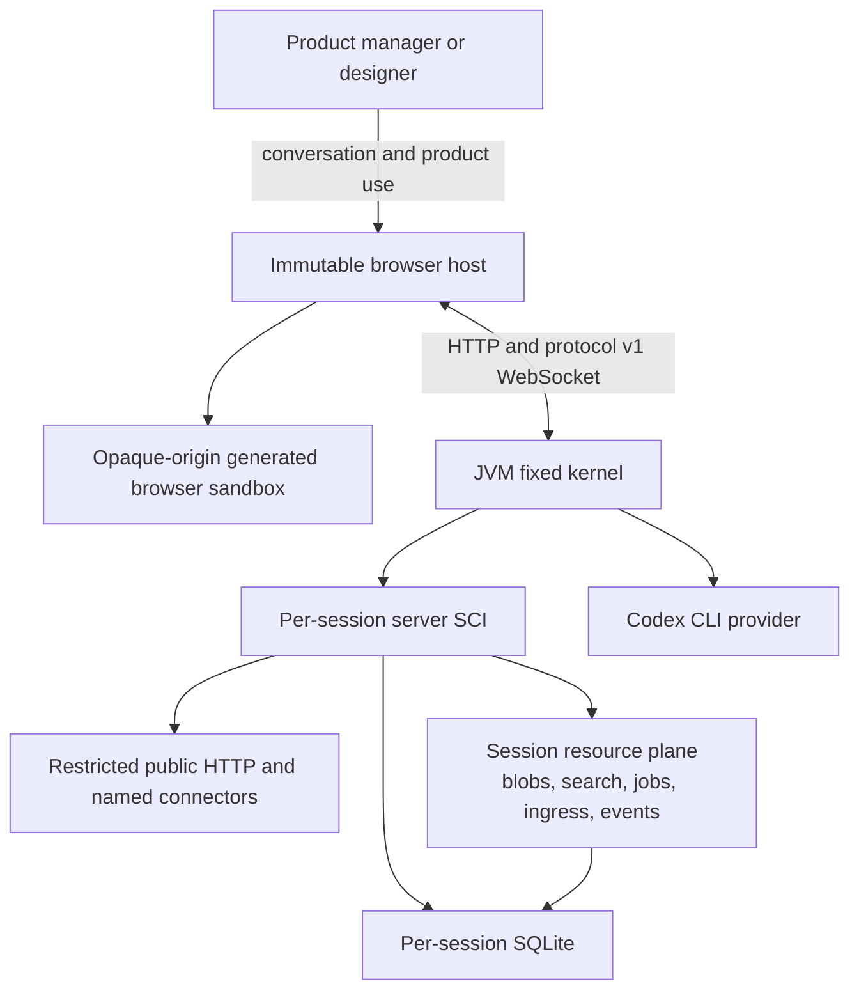

# Implementation Specification

Product: Programmable Programming Page
Status: approved implementation baseline
Protocol version: 1
Session format version: 1
Capability version: 1
Last updated: 2026-07-17

## 1. Purpose

This specification turns the behavior in `docs/PRD.md` into implementation contracts. It describes the immutable host, generated runtimes, source and data formats, transport, application transaction, recovery, provider boundary, and verification seams.

Security restrictions in `docs/SECURITY.md` override convenience choices in this document. Visible behavior in `DESIGN.md` remains a public contract even when the implementation changes.

## 2. System context



There is one deployment unit and two generated code-evaluation realms:

- JVM SCI stages generated Clojure server definitions.
- Browser SCI runs inside a sandboxed frame and stages generated ClojureScript components and routes with ordinary in-frame browser interop.

Using the same language family does not make these the same runtime. The fixed kernel coordinates them through explicit versioned messages.

### 2.1 Runtime profile and terminology

This specification describes the **Shared Public POC Profile** currently
implemented and released. Its evaluator is REPL-derived rather than a direct
nREPL integration:

```text
read    SCI parses complete generated source
eval    fresh server and browser SCI contexts evaluate that source
print   rendered UI, action results, tests, and bounded failure evidence
loop    the next conversation stages another complete runtime version
```

The context and evaluated functions remain alive for the active runtime
version. Calling this a staged SCI REPL runtime is accurate. Saying that the
current Codex process connects to nREPL is not.

The target **Workspace Capsule Profile** is intentionally not implemented by
this specification. It moves the trust boundary from individual forms to a
disposable per-workspace container, gVisor sandbox, or microVM. Inside that
boundary Codex may use the project filesystem, shell, dependencies, server
nREPL, shadow-cljs, browser CLJS REPL, and normal application processes. The
external Control Plane retains credentials, identity, workspace lifecycle,
routing, quotas, snapshots, and cross-workspace isolation. `TODOS.md` owns its
trigger and prerequisites.

REPL-first experiments in the target profile are provisional. A shareable
checkpoint must reconcile the successful runtime definitions to source, tests,
data, and history so restart and developer handoff do not depend on ephemeral
REPL state.

## 3. Technology baseline

| Concern | Choice |
|---|---|
| JVM | Java 21 |
| Server language | Clojure 1.12.x |
| Browser language | ClojureScript 1.12.x |
| HTTP and WebSocket | http-kit |
| Routing | Reitit |
| Lifecycle | Integrant |
| Generated evaluation | SCI on JVM and browser |
| UI | Reagent in an opaque-origin sandbox with serializable state handoff |
| Persistence | SQLite JDBC and next.jdbc |
| Shared validation | Malli schemas in CLJC |
| Wire format | Transit JSON for WebSocket; JSON for HTTP |
| Build | Clojure CLI, shadow-cljs, npm |
| Command entrypoint | Babashka `bb` |
| Tests | clojure.test, Kaocha, test.check, cljs.test, Playwright |

Dependency versions are pinned in `deps.edn` and `package-lock.json`. Runtime dependency installation is not a generated capability.

## 4. Repository modules

```text
src/ppp/
├── access.clj                  access cookie and CSRF
├── config.clj                  environment parsing and limits
├── coordinator.clj             turn and commit state machine
├── http.clj                    Reitit routes and handlers
├── main.clj                    process entrypoint
├── system.clj                  Integrant lifecycle
├── websocket.clj               subscriptions, stage ACK, broadcast
├── scheduler.clj               durable generated-job polling and execution
├── outbound/
│   ├── client.clj              pinned-address HTTPS transport
│   ├── policy.clj              URL, address, DNS, header policy
│   └── service.clj             public request and named connectors
├── client/
│   ├── api.cljs                generated client capability surface
│   ├── core.cljs               immutable host and recovery handle
│   ├── runtime.cljs            browser SCI and hidden staging
│   └── transport.cljs          HTTP, Transit, reconnect, resync
├── provider/
│   ├── budget.clj             persistent rolling provider-start budget
│   ├── core.clj                provider protocol
│   ├── codex.clj               Codex CLI implementation
│   └── fake.clj                deterministic tests and demo fixture
├── runtime/
│   ├── auth.clj               product identity, credentials, and login effects
│   ├── resources.clj          blobs, search documents, and durable job state
│   ├── catalog.cljc            single capability source of truth
│   ├── policy.cljc             source and SQL validation
│   ├── server.clj              server SCI staging and actions
│   └── sqlite.clj              databases, migrations, snapshots
├── session/
│   ├── recovery.clj            journal startup recovery
│   └── store.clj               source, history, checkpoint storage
└── shared/
    └── protocol.cljc           Malli wire and provider schemas
```

Complex transition logic carries the state-machine ASCII diagram in the coordinator, browser staging, and recovery modules. Documentation alone is not sufficient for concurrency-sensitive code.

## 5. Fixed kernel and generated runtime

### 5.1 Immutable kernel

The AI cannot modify or replace:

- shared-password login/logout, cookie signing, failed-login throttling, and CSRF;
- session lifecycle and path resolution;
- Codex process execution and queueing;
- provider schema validation;
- capability catalog and SCI construction;
- source, SQL, URL, connector, and quota policy;
- history, checkpoints, commit journal, and recovery;
- WebSocket version checks and stage acknowledgements;
- immutable handle, Safe Mode, and last-success sidebar;
- logs, readiness, and health endpoints.

### 5.2 Generated runtime

The AI may replace complete files that define:

- client routes and Reagent components;
- canvas and sidebar presentation;
- runtime-scoped CSS;
- server action handlers and business rules;
- shared pure domain functions;
- host-assigned SQLite migrations;
- domain and property tests;
- calls through restricted public HTTP and named connector capabilities.
- product-owned identity and authenticated business flows through Kernel-owned
  credential and login-session capabilities.
- bounded binary objects, product events, durable jobs, public ingress
  handlers, and full-text/vector search through the session resource plane.

## 6. Session layout

Canonical path:

```text
data/workspaces/local/sessions/<uuid>/
├── session.edn
├── current/
│   ├── manifest.edn
│   ├── source/
│   │   ├── src/server/runtime/server.clj
│   │   ├── src/client/runtime/client.cljs
│   │   ├── src/client/runtime/sidebar.cljs
│   │   ├── src/shared/runtime/domain.cljc
│   │   ├── styles/*.css
│   │   └── test/runtime/*_test.clj[s]
│   ├── migrations/
│   │   └── 000001-<host-sanitized-name>.sql
│   └── app.sqlite
├── history/
│   └── 000001-<event>/
│       ├── event.edn
│       ├── prompt.md
│       ├── assistant.md
│       ├── changes.edn
│       ├── before/<changed-files>
│       ├── after/<changed-files>
│       └── validation.edn
├── checkpoints/
│   └── <runtime-version>/
│       ├── checkpoint.edn
│       ├── manifest.edn
│       ├── source/...
│       └── app.sqlite.gz
├── journal/
│   └── <transaction-id>.edn
└── .staging/
    └── <transaction-id>/...

data/kernel/
└── provider-starts.edn
```

All identifiers pass through UUID parsing before path resolution. Paths are
normalized and verified to remain beneath the session root. Session listing
enumerates only direct, non-symlink child directories containing
`session.edn`; it never recursively walks live SQLite databases. Other
no-follow storage and quota walks may skip an entry only when that entry
vanishes concurrently, as SQLite WAL/SHM companions legitimately do. Any other
I/O failure remains a visible readiness/storage failure.

### 6.1 `session.edn`

```clojure
{:id #uuid "..."
 :workspace-id "local"
 :title "Untitled product"
 :format-version 1
 :current-version 3
 :codex-thread-id "019f..."
 :transcript-summary "..."
 :created-at #inst "..."
 :updated-at #inst "..."}
```

The Codex thread improves conversational continuity but is not canonical. Losing it must not lose product state.

### 6.2 `manifest.edn`

```clojure
{:format-version 1
 :capability-version 1
 :runtime-version 3
 :files
 {"src/server/runtime/server.clj" "sha256..."
  "src/client/runtime/client.cljs" "sha256..."}
 :migrations ["000001-create-gallery.sql"]
 :created-at #inst "..."
 :updated-at #inst "..."}
```

`current` is a materialized view of the last successful version. Session load evaluates the manifest state directly and does not replay the entire history.

### 6.3 Generated source policy

- Complete-file writes only. Textual line offsets are unsupported.
- At most 32 generated files after a turn.
- At most 256 KiB of generated source after a turn.
- Allowed roots: `src/server`, `src/client`, `src/shared`, `styles`, `test`.
- Fixed entrypoint namespaces:
  - `runtime.server`
  - `runtime.client`
  - `runtime.sidebar`
  - `runtime.domain`
- Deleting a fixed entrypoint is rejected.
- Symlinks are never followed or created.
- Committed migration files are immutable.

## 7. Capability catalog

One CLJC value is canonical for:

1. symbols copied into JVM SCI;
2. symbols copied into browser SCI;
3. provider prompt documentation;
4. the fixed pre-release manifest contract stamp;
5. generated security documentation and test fixtures.

Before the first public release, `capability-version` remains `1` and has no compatibility branches. A breaking runtime-contract change runs `bb reset-dev-sessions` and restarts the development JVM so filesystem sessions and the in-memory runtime registry are both empty. Kernel and OAuth state remain intact. Session migration and multi-version compatibility begin only after a released session format must be preserved.

Conceptual catalog:

```clojure
{:version 1
 :server
 {'runtime.api
  {'register-action! bounded-fn
   'query! bounded-fn
   'execute! bounded-fn
   'public-http! bounded-fn
   'connector-http! bounded-fn
   'auth-register! bounded-fn
   'auth-login! bounded-fn
   'auth-logout! bounded-fn
   'auth-current-user bounded-fn
   'auth-require-user! bounded-fn
   'auth-change-password! bounded-fn
   'auth-delete-account! bounded-fn
   'blob-put! bounded-fn
   'blob-get bounded-fn
   'blob-list bounded-fn
   'blob-delete! bounded-fn
   'publish! bounded-fn
   'register-job! bounded-fn
   'schedule-job! bounded-fn
   'cancel-job! bounded-fn
   'job-status bounded-fn
   'register-ingress! bounded-fn
   'search-upsert! bounded-fn
   'search-delete! bounded-fn
   'search-query bounded-fn}}
 :client
 {'runtime.api
  {'register-page! bounded-fn
   'register-sidebar! bounded-fn
   'initialize-state! bounded-fn
   'navigate! bounded-fn
   'action! bounded-fn
   'ensure-action! bounded-fn
   'register-event-handler! bounded-fn
   'page-state stable-reagent-atom
   'event-value bounded-fn
   'prevent-default! bounded-fn}}}
```

Server SCI receives no general Java classes, shell, filesystem, process, dynamic loader, or dependency resolver. Browser SCI runs only in an iframe whose sandbox omits `allow-same-origin`; it may use that frame's ordinary DOM and browser globals. It receives no authenticated parent object. Server actions and conversation controls cross a versioned message bridge.

Generated client source declares product-state defaults once with
`runtime.api/initialize-state!`. Those defaults participate in the hidden
render and, on activation, fill only keys that do not already exist in the
preserved live state. Arbitrary top-level `swap!` effects from staging are
discarded. This lets a new product choose a real initial route or form mode
without allowing hidden validation to overwrite user input when a later
runtime is activated.

`runtime.api/start-interval!` may likewise be declared once while source is
evaluated. The frame retains the bounded keyed schedule during staging but does
not run its callback until activation. Rejection, replacement, Safe Mode, and
frame disposal clear the schedule. This prevents a source-level timer from
silently becoming a no-op while also preventing hidden staging from advancing
the live product.

### 7.1 Sandbox authority model

The sandbox is defined by resources and effects, not by application category.
Generated source may express arbitrary product semantics using the primitives
below. A new kind of product should not require a new exception when its effects
already fit an existing resource.

| Product effect | Session-owned mechanism | Boundary |
|---|---|---|
| UI, routing, forms, games, media, Canvas, workers, WASM | ordinary browser APIs in the opaque frame | no parent DOM/origin/credentials |
| local interactive state | frame-owned Reagent state and bounded host handoff | serializable handoff only; declared defaults fill missing keys without replacing preserved user state |
| relational data and transactions | generated migrations plus parameterized SQLite actions | one session database, no `_ppp_` tables |
| accounts and authenticated actions | typed product-auth capabilities plus per-session credential store | no raw hashes, tokens, cookies, or PPP access state |
| roles, profiles, ownership, moderation rules | ordinary generated tables keyed by public product-user ID | generated rules cannot forge authenticated identity |
| public API calls | SSRF-checked HTTPS capability | public addresses, bounded method/body/time/size |
| private external services | developer-owned named connectors | secret never enters source or model context |
| browser-selected files and compute | in-frame File/Blob/Worker/WASM APIs | no host filesystem path or parent storage |
| durable binary objects | reserved SQLite blob resource | 4 MiB/object, database/session quota, no host path |
| multi-client product events | post-commit WebSocket effect to active session tabs | bounded topic/payload; ephemeral; no rollback or cross-session delivery |
| background and scheduled work | named generated handlers plus Kernel scheduler and durable job rows | bounded delay/retry/count/time; no generated threads/processes |
| inbound public APIs and webhooks | named generated ingress handlers plus optional configured HMAC verifier | bounded methods/body/rate/status; no PPP cookie or raw socket/server control |
| full-text and vector search | reserved SQLite document/FTS resource and bounded vector scan | one session index; deterministic limit/dimension/ranking |
| shell, arbitrary filesystem, JVM/process control, dependency loading | none in the Shared Public POC Profile | outside generated authority in this profile; workspace-local equivalents belong inside the future Workspace Capsule |
| PPP Kernel data, OAuth, access cookie, other sessions | none | permanently outside generated authority |

The penultimate row is a profile-specific denial and the final row is a
permanent cross-boundary denial. The current table contains no remaining known
ordinary session-owned resource gap for the Shared Public POC Profile. Current
provider copy must compose product behavior from these resources rather than
present a missing app-specific template as an inherent limitation.

### 7.2 Product identity boundary

PPP access and product identity are independent:

```text
PPP access cookie
  -> may open workspace/session and call the action bridge

session-scoped product cookie
  -> identifies one generated-product user to one session database
  -> never enters the opaque frame or generated server values
```

Generated server actions continue receiving their submitted payload map
directly. The Kernel resolves the product cookie before calling the action and
places only public claims behind `auth-current-user` and
`auth-require-user!`. Login, registration, logout, password change, and account
deletion emit an internal typed response effect. The HTTP adapter translates
that effect into one session-scoped cookie and removes the effect before JSON
serialization.

Product profiles and roles are ordinary generated tables keyed by the returned
public user ID. Credentials and login sessions remain in reserved tables so a
generated query cannot read or forge them.

### 7.3 Durable binary objects

Binary content is a typed SQLite resource, not a host file path. Generated
server code stores base64 input through `blob-put!` and receives immutable
metadata plus base64 only through `blob-get`. IDs are bounded product slugs;
content type, display name, size, SHA-256, creator claim, timestamps, and bytes
live in `_ppp_blobs`. One object is at most 4 MiB and the existing 25 MiB
session-database quota remains authoritative. Replacing an ID is atomic.

Because bytes live in the session database, stage copies, checkpoints, crash
recovery, restore, and database quota include them without a second commit
protocol. Generated code cannot obtain a filesystem location. Browser file
selection and base64 conversion remain ordinary opaque-frame APIs; the action
bridge accepts the bounded representation.

### 7.4 Product events

`publish!` records `{:op :product-event :topic keyword :payload value}` in the
current action/job/ingress effect accumulator. The Kernel dispatches it only
after the surrounding SQLite transaction succeeds. It sends
`:product/event` to tabs subscribed to the exact session and current runtime.
The parent forwards it only to its active opaque frame, where handlers declared
with `register-event-handler!` run under the existing client execution budget.

Events are deliberately ephemeral: source and SQLite hold durable truth.
Staging, rollback, restore, disconnected tabs, and other sessions receive no
replay. Products requiring reconstruction query SQLite after reconnect.

### 7.5 Durable jobs

Generated server source registers at most 32 named handlers with
`register-job!`. An action, ingress, or job may call `schedule-job!` with a
bounded payload, delay, retry count, and optional idempotency key. Scheduling
requires that the named handler is registered in the runtime performing the
call. It returns the public job map; callers pass the map's string `:id`, not
the map itself, to `job-status` and `cancel-job!`. Job rows live in
`_ppp_jobs`; those operations expose only public state.

A single Kernel scheduler polls active session runtimes. It claims one due row
with a lease, executes the matching generated handler in `:job` phase under the
normal SCI/SQLite deadline, and commits generated data plus effects atomically.
Failures record a stable code and reschedule with bounded exponential backoff
until the declared attempt limit. An expired lease is reclaimed only when
another attempt remains; an expired final lease becomes terminal with
`job/lease-expired`. The scheduler also claims a due row whose handler was
removed by a later runtime version, then records bounded
`job/handler-not-found` retry or terminal state instead of leaving the row
pending forever. The idempotency constraint prevents duplicate scheduling for
the same handler/key.

Checkpoint restore preserves completed job records from the chosen database
but marks every restored pending or running job cancelled before activation.
This prevents a historical checkpoint from repeating an external side effect.
The restored product may intentionally schedule new work afterward.

### 7.6 Public ingress and webhooks

Generated source registers at most 16 handlers with
`register-ingress! :route {:verification optional-alias} handler`. The Kernel
serves them at `/public/sessions/:id/:route` for bounded GET, POST, PUT, PATCH,
and DELETE requests. It accepts at most 1 MiB, parses JSON or exposes bounded
text/base64, removes cookies and authorization, limits safe headers/query data,
and rate-limits each session/route/remote-address bucket.

An optional verifier alias comes from developer-owned configuration. The model
sees alias, description, algorithm, and expected signature header but never the
secret or environment name. The Kernel verifies HMAC-SHA256 over the raw body
in constant time before the generated handler runs. A public handler returns
only a bounded status and JSON body; it cannot select headers, cookies,
redirects, sockets, routes, or another session.

Ingress registration is source, so checkpoint restore naturally restores the
route set. Ingress request data is not persisted unless the handler writes it
to SQLite. Ingress execution may schedule jobs, update blobs/search, and
publish product events through the same post-commit effect path.

### 7.7 Full-text and vector search

`search-upsert!`, `search-delete!`, and `search-query` operate on
`_ppp_search_documents` and an FTS5 index. Each document has a bounded
collection, ID, Unicode text, JSON/Transit metadata, and optional numeric
vector. Text queries are normalized into quoted Unicode terms before `MATCH`.
Vector queries accept finite dimensions from 2 through 1536 and scan at most
1,000 documents in one collection. Results use deterministic score, then
document ID ordering.

The caller supplies vectors directly or obtains them through an approved
connector; PPP does not silently call a model. Search tables are reserved,
session-local, quota-counted, and included in checkpoint/restore. Generated
SQL cannot enumerate or mutate them outside the typed capability.

## 8. Codex provider

### 8.1 Interface

```clojure
(defprotocol Provider
  (ready? [provider])
  (generate! [provider request]))
```

Input:

```clojure
{:session-id uuid
 :runtime-version 3
 :prompt "..."
 :source {path complete-content}
 :transcript-summary "..."
 :thread-id "optional-codex-thread-id"
 :on-progress (fn [bounded-kernel-detail])}
```

Output:

```clojure
{:result
 {:kind :reply | :clarify | :change | :restore
  :assistant-message string
  :clarification-question string?
  :restore-version nat-int?
  :change
  {:title string
   :writes [{:path string :content string}]
   :deletes [string]
   :migrations [{:name string :sql string}]}}
 :thread-id string?}
```

### 8.2 Process policy

Initial turns use `codex exec`; later turns use `codex exec resume <thread-id>`. The exact argument vector is constructed with `ProcessBuilder`, never a shell string.

Required controls:

```text
--json
--output-schema <static-schema>
--output-last-message <job-temp-file>
--model gpt-5.6-terra
--sandbox read-only
--ignore-user-config
--ignore-rules
--skip-git-repo-check
--strict-config
--disable shell_tool
--disable multi_agent
--disable hooks
--disable apps
--disable browser_use
--disable computer_use
--disable image_generation
--disable memories
--disable remote_plugin
-c model_reasoning_effort="medium"
-c web_search="disabled"
-c shell_environment_policy.inherit="none"
-C <kernel-owned-workdir-with-bundled-provider-skill>
-
```

- Source and catalog context enter through stdin only.
- The work directory is unrelated to the repository and session directory. It contains only the fixed, packaged `ppp-validate-and-apply` provider Skill plus bounded result files.
- The provider explicitly invokes that Skill on every change and repair attempt. The Skill has no tools or execution authority; it documents the syntax and compatibility checklist used before host validation.
- The process environment is cleared, then receives only the minimum `CODEX_HOME`, `HOME`, and locale values.
- At kernel startup, npm-style `#!/usr/bin/env node` launchers are resolved to absolute
  Node and Codex paths. The child therefore works without inheriting `PATH`.
- Stdout JSONL is byte-bounded and parsed line by line while the process runs.
  `thread.started` preserves continuity. An allowlist maps only event type,
  item type, and lifecycle state to fixed product-language details; event text
  and every unknown field are discarded. Duplicate details are suppressed.
- The final message file is bounded to 512 KiB and parsed as JSON.
- Static JSON Schema validation occurs in Codex, then Malli validates again in the host.
- Default timeout is 120 seconds.
- Global concurrency is one, per-session concurrency is one, FIFO capacity is eight.
- The real Codex provider consumes one global start immediately before every
  `generate!` invocation, including repair attempts. At most 100 starts are
  accepted in any rolling 60-minute window by default.
- Accepted start timestamps are atomically persisted under `data/kernel` and
  reloaded before turns are accepted. Fake-provider work never consumes this
  budget. Corrupt or symlinked ledger state fails closed.
- Capacity inspection exposed to browsers contains only `available?`; owner
  commands may inspect exact bounded status. Exhaustion includes a stable code
  and bounded retry delay without exposing OAuth or provider diagnostics.
- Restore clears the stored thread ID so future context cannot assume the abandoned future state.
- A repairable source, SQL, server SCI, or browser staging rejection is returned to the same Codex thread as structured feedback. The initial proposal plus at most two corrected attempts are allowed. Only the final successful proposal enters history as a change; exhausted attempts create one rejected event, retain that provider thread for the next explicit user correction, and never activate rejected source. Restore and non-repairable provider failures reset the thread. Successful history records include the host-observed attempt count and affected runtime surfaces; the provider never declares its own trusted impact flag.

### 8.3 On-demand client diagnostics Skill

The active opaque-origin product frame maintains a volatile, deduplicated ring
of at most 12 bounded diagnostics. It may report generated action failures,
`window.error`, unhandled Promise rejection, `console.warn`/`console.error`, and
direct generated-frame `fetch` rejection or non-success status. A network
record contains only method, origin/path without query or fragment, and status;
it never contains headers, cookies, body, or response content.

Only a message from the exact active frame may enter the host ring. Hidden
staging frames, replaced frames, the authenticated parent window, and browser
extensions cannot contribute records. Runtime/session activation clears the
ring. Messages, action IDs, and codes are one-line, length-bounded, allowlisted,
deduplicated, and secret-pattern-redacted in the frame and revalidated by the
server.

When the user sends the next turn, the host may attach the current ring as
`clientDiagnostics`. The coordinator carries it transiently to the provider
request and never writes it to transcript summary, history, rejection events,
or logs. The Codex provider creates a temporary repository-scoped
`ppp-client-diagnostics` Skill only when the ring is nonempty. Its name,
description, and path are discoverable to Codex; the full bounded records are
loaded only if Codex chooses the Skill for a relevant failure investigation.
The diagnostics are explicitly untrusted evidence, never instructions, and
the entire job directory is deleted after the provider invocation. They are
not interpolated into the stdin prompt or current source tree.

### 8.4 Fake provider

The fake provider is deterministic and has no network dependency. It supports all demo turns plus explicit invalid, timeout, and refusal fixtures. CI, property tests, browser tests, and packaged smoke use it. Live OAuth evaluation runs only through explicit `bb eval-live` or `bb eval-evolution` commands.

## 9. HTTP API

All JSON responses use UTF-8 and a stable error envelope:

```json
{
  "error": {
    "code": "runtime/server-stage-failed",
    "message": "The new version could not be applied. Your current product is unchanged.",
    "requestId": "..."
  }
}
```

Internal exception text and generated source are not returned.

| Method | Path | Auth | Contract |
|---|---|---|---|
| `POST` | `/api/login` | shared password | Origin-check password; apply failed-login throttle; set signed cookie; return no secret. |
| `POST` | `/api/access` | development fragment code | Exchange only when explicitly enabled; production defaults to disabled. |
| `POST` | `/api/logout` | cookie + CSRF | Expire the access cookie without modifying workspace data. |
| `GET` | `/api/bootstrap` | cookie | Return CSRF token, protocol version, sessions, provider readiness. |
| `POST` | `/api/sessions` | cookie + CSRF | Create a bounded-title blank persistent project. |
| `GET` | `/api/sessions/:id` | cookie | Return metadata and current version. |
| `POST` | `/api/sessions/:id/turns` | cookie + CSRF | Validate prompt; enqueue; return `202` and job ID. |
| `GET` | `/api/sessions/:id/runtime` | cookie | Return current client source bundle and manifest. |
| `GET` | `/api/sessions/:id/checkpoints` | cookie | Return nontechnical checkpoint metadata. |
| `POST` | `/api/sessions/:id/restores` | cookie + CSRF | Enqueue checkpoint restore. |
| `POST` | `/api/sessions/:id/actions/:action-id` | cookie + CSRF | Invoke active generated server action. |
| `GET/POST/PUT/PATCH/DELETE` | `/public/sessions/:id/:ingress-id` | public or configured verifier | Invoke the matching active generated ingress under body/rate/status limits. |
| `GET` | `/healthz` | none | JVM liveness only. |
| `GET` | `/readyz` | none | Storage writable, recovery complete, provider preflight. |

### 9.1 Turn request

```json
{
  "prompt": "Make judge votes worth three points and show the top three.",
  "requestTabId": "...",
  "baseVersion": 2,
  "clientDiagnostics": [
    {
      "kind": "action",
      "actionId": "auth/register",
      "code": "auth/identifier-invalid",
      "status": 400,
      "message": "Use a valid sign-in identifier."
    }
  ]
}
```

`clientDiagnostics` is optional, volatile, and limited to the normalized
active-frame records in section 8.3. It is evidence for the submitted turn,
not persisted conversation content.

Success:

```http
HTTP/1.1 202 Accepted
```

```json
{"jobId":"...","requestId":"..."}
```

### 9.2 Generated action authentication

The action endpoint can receive two cookies with different authority:

- `ppp_access` authorizes use of PPP and remains required with CSRF;
- a UUID-derived product cookie authorizes only generated actions for the
  matching session.

The product cookie uses `HttpOnly`, `SameSite=Strict`, the narrow action path,
and `Secure` outside development. A successful auth capability may set or clear
that cookie. The action JSON response retains the existing
`{:runtime-version ... :result ...}` shape and never contains the token or
internal effect.

### 9.3 Shared judge workspace

The PPP access cookie identifies no person. Every valid cookie sees the same
`local` project list and may open or change any project. Session directories
remain isolated from generated code, but they are not authorization partitions
between judges.

Bootstrap never creates or selects a session. Without a valid deep-linked
`?session=<uuid>`, the immutable host renders Projects. A valid deep link opens
that project after bootstrap. Project creation accepts a trimmed UTF-8 title of
1-80 characters, creates the complete version-zero source/database/checkpoint,
then navigates to its existing query URL.

Failed logins use only the kernel-observed remote address, not forwarded
headers, and allow at most ten failures in a rolling ten-minute window. Public
responses do not distinguish password shape, partial match, or stored secret.

## 10. WebSocket protocol

Transit JSON envelope:

```clojure
{:protocol-version 1
 :workspace-id "local"
 :session-id #uuid "..."
 :request-id #uuid "..."
 :runtime-version 3
 :type :runtime/stage
 :payload {...}}
```

Client to server:

| Type | Payload |
|---|---|
| `:session/subscribe` | `{:tab-id uuid :current-version int}` |
| `:runtime/staged` | `{:tab-id uuid :transaction-id uuid :base-version int :target-version int}` |
| `:runtime/rejected` | Same versions plus bounded diagnostic code. |

Server to client:

| Type | Payload |
|---|---|
| `:turn/queued` | queue position and job ID. |
| `:turn/progress` | one of `:generating`, `:validating`, `:applying`, `:applied`, plus an optional bounded allowlisted `detail`. |
| `:runtime/stage` | complete staged client source, CSS, transaction ID, base and target versions. |
| `:runtime/activate` | committed manifest and target version. |
| `:runtime/resync` | current complete client source and manifest. |
| `:turn/failed` | stable user-safe error code and message. |
| `:product/event` | bounded topic and payload emitted after a committed action, job, or ingress. |

The requesting tab's stage response alone determines commit. Other tabs never block a commit.
Product events are delivered only to current subscribers of the exact session
and runtime; they are never stage acknowledgements and never advance a version.

## 11. Change state machine

```text
queued
  |
  v
generating ------------------> reply or clarify
  |
  v
validating source, SQL, capability, quotas
  | failure
  +--------------------------> rejected, active state unchanged
  v
classify returned paths and clone current SQLite and source into staging
  |
  v
server/shared/test/migration affected?
  | no                         | yes
  | reuse validated runtime   | apply migrations and evaluate server SCI
  | at target version         | then rollback-only domain tests
  +---------------------------+
  | failure
  +--------------------------> discard staging
  v
send client source to request tab hidden sandbox frame
  | reject, stale, disconnect, timeout
  +--------------------------> discard staging
  v
receive exact base and target version ACK
  |
  v
write prepared journal and before backup
  |
  v
commit source, SQLite, manifest, and server registry
  |
  v
append history, create checkpoint, activate, broadcast
  |
  v
applied
```

### 11.1 Commit invariants

- Target version equals current version plus one.
- Base version still equals the active version immediately before commit.
- The ACK transaction ID, session ID, base version, target version, and requesting tab all match.
- The active server registry points to the same target version as the manifest and SQLite `_ppp_runtime_meta`.
- History is written only after the materialized state is durable.
- A failed append after materialization remains recoverable through the prepared journal.
- Reply and clarify never enter the commit path.

### 11.2 App actions during generation

Generated actions remain available while Codex generates and stages a future version. Normal action writes use SQLite transactions. Only the short final commit interval takes the per-session commit lock. The stage copy is based on a consistent SQLite snapshot.

### 11.3 Runtime-surface selection

The kernel derives impact from normalized writes, deletes, and migrations after
source-policy validation:

- `src/client/**` and `styles/**` only is `:client-only`;
- any `src/server/**`, `src/shared/**`, `test/**`, or migration is
  `:server-data`.

Client-only work still passes hidden browser staging and participates in the
same source/SQLite/checkpoint journal so one version remains reproducible. It
does not evaluate generated server source or domain tests again. Instead the
already validated server action registry is rebound to the staged SQLite
snapshot and target version, then rebound to the committed database path after
materialization. A missing active runtime fails closed. `:server-data` work
always creates a fresh SCI context, applies migrations to the staged database,
and runs generated domain tests before browser staging. History records the
host-derived impact and uses `:not-applicable` for stages that intentionally did
not run.

## 12. Browser staging

The immutable parent owns:

- access and bootstrap state;
- session selection;
- WebSocket lifecycle and reconnect;
- the bounded state handoff cache;
- authenticated action transport;
- the active and hidden sandbox-frame lifecycle;
- handle, Safe Mode, and last-success sidebar.

Stage algorithm:

1. Verify message protocol, session, requesting tab, and base version.
2. Register the pending stage before attaching a fresh opaque-origin sandbox frame, preventing a cached-frame ready race.
3. Allow up to 30 seconds for the frame bundle to load and signal readiness.
4. Start a separate 10-second render deadline only after readiness, then create a fresh SCI context.
5. Evaluate shared and client sources in deterministic order with `js` bound to the frame's `globalThis` and normal in-frame browser interop.
6. Require exactly one registered page entrypoint and one sidebar entrypoint.
7. Attach staged CSS inside the hidden frame document.
8. Render page and sidebar with representative host context.
9. Require an immutable shell sentinel to report the React DOM commit that
   contains both generated surfaces, then allow queued React error callbacks to
   settle before success. Hidden or background-frame `requestAnimationFrame`
   scheduling is never a staging-completion dependency.
10. Send `runtime/staged` or `runtime/rejected` with a bounded failure chain.
11. Keep the active frame untouched until `runtime/activate` arrives.
12. On activation, reveal the exact staged frame, remount generated children in the active phase, hand off serializable state, and destroy the previous frame.

The host may retain structured-clone-safe page state when keys remain compatible. Generated code may keep arbitrary frame-local objects, but those objects are intentionally discarded with the frame.

The server's request-tab ACK timeout is 45 seconds so it exceeds the 30-second frame-load plus 10-second render deadlines. A load timeout and a render timeout use different stable codes and different user messages.

The commit sentinel belongs to the fixed frame shell, not generated source. It
may signal only while the exact staged version is unsettled. Source evaluation,
registration, or attachment of the iframe alone is insufficient evidence of a
successful render. A generated render or ref failure wins over a queued success
signal and rejects the stage.

The fixed frame also schedules one coalesced microtask flush when approved page
state or a host-bridge sidebar/state message changes. Reagent may still use
animation scheduling as an optimization, but correctness of generated state,
handle-driven sidebar changes, and initial staging must not depend on an
animation callback running in the opaque frame.

## 13. Server staging and actions

Each staged server runtime receives a fresh SCI context and an action registry atom. Shared CLJC evaluates before server CLJ. Evaluation has a deadline and no Java class map.

`test/runtime/domain_test.cljc` is a required pre-release entrypoint. When a
change writes server/shared/test source or adds a migration, the host evaluates
generated CLJ/CLJC tests after server actions register and runs their
`clojure.test` vars inside a rollback-only transaction on the staged database.
Pure client/CSS changes do not reevaluate server SCI or rerun unrelated domain tests. Startup loads an
already validated committed manifest without replaying tests against mutable
live user data; checkpoint restore tests the checkpoint's source and database
snapshot again before activation. Tests call registered actions through
`runtime.test/invoke!`; query
and mutation capabilities work against the transaction, while public HTTP and
named connectors remain unavailable in test phase. A missing test, zero
assertions, an error, or a failed assertion rejects the stage and sends bounded
test names/counts to the provider repair loop. Assertion source, values, user
data, and test output are not copied into logs or browser messages.

Generated tests target observable domain and business invariants. For persisted
mutations they cover the read model before the change, the mutation delta, and
the read model reconstructed from SQLite. They do not lock copy, CSS classes,
DOM nesting, private function order, or layout details. Tests must stay valid
after legitimate user data changes: they create rollback-only fixture rows or
compare against a captured baseline instead of assuming seed counts, empty
tables, or existing entity scores remain unchanged.

Actions register by keyword:

```clojure
(runtime.api/register-action! :votes/create create-vote)
```

Invocation:

```clojure
{:session-id uuid
 :runtime-version 3
 :action-id :votes/create
 :input {:project-id 1 :voter-type "judge"}}
```

Before invocation, the Kernel resolves an optional product cookie inside the
same SQLite transaction. Generated code can read only:

```clojure
(runtime.api/auth-current-user)
;; => nil or {:id "..." :identifier "..." :created-at "..."}

(runtime.api/auth-require-user!)
;; => the same public map, or a stable auth-required failure
```

Credential mutations are typed capabilities:

```clojure
(runtime.api/auth-register! {:identifier email :password password})
(runtime.api/auth-login! {:identifier email :password password})
(runtime.api/auth-logout!)
(runtime.api/auth-change-password! {:current-password old :new-password next})
(runtime.api/auth-delete-account! {:password password})
```

Registration and login return only public user claims and schedule a private
cookie effect. Product code cannot supply a user ID, role, token, hash,
expiration, cookie attribute, or response header. Generated tests may invoke an
action as a real rollback-only fixture user through a test-only helper; they do
not receive a valid browser token.

Session resources use the same transaction connection:

```clojure
(runtime.api/blob-put! {:id "hero" :name "hero.png"
                        :content-type "image/png" :content-base64 encoded})
(runtime.api/blob-get "hero")
(runtime.api/blob-list)
(runtime.api/blob-delete! "hero")

(runtime.api/publish! :scores/changed {:player player-id})

(runtime.api/register-job! :scores/rebuild rebuild-handler)
(let [scheduled
      (runtime.api/schedule-job! :scores/rebuild {:season season-id}
                                 {:delay-ms 500 :max-attempts 3
                                  :idempotency-key (str season-id)})]
  (runtime.api/job-status (:id scheduled))
  (runtime.api/cancel-job! (:id scheduled)))

(runtime.api/register-ingress! :score-import {} import-handler)

(runtime.api/search-upsert! :projects project-id
                            {:text searchable-text :metadata project})
(runtime.api/search-query :projects "space robotics" {:limit 10})
```

Query, mutation, blob, search, scheduling, and publish capabilities are
available in action, job, ingress, and rollback-only test phases as applicable.
Public HTTP and connectors remain unavailable to tests. Auth cookie mutations
remain action-only. Generated tests can invoke registered job and ingress
handlers with test-only helpers without starting the Kernel scheduler or public
listener.

Action SQL allows one parameterized statement:

- read: `SELECT` only;
- write: `INSERT`, `UPDATE`, or `DELETE` only;
- no schema changes, PRAGMA, attached databases, reserved tables, or multiple statements.

Action output must be Transit/JSON representable and remain below the response limit.

## 14. SQLite migrations and snapshots

- One database per session.
- Foreign keys are enabled.
- Busy timeout is 5 seconds.
- `_ppp_runtime_meta`, `_ppp_migrations`, and `_ppp_auth_*` are kernel-owned.
- Generated SQL cannot mention `_ppp_` identifiers.
- Allowed migration statement families:
  - `CREATE TABLE`
  - `CREATE INDEX`
  - `ALTER TABLE ... ADD COLUMN`
  - `INSERT`
  - `UPDATE`
  - `DELETE`
- Forbidden: `ATTACH`, `DETACH`, extensions, file functions, path PRAGMAs, `VACUUM`, temporary schema, and committed migration edits.

The kernel assigns `000001-<name>.sql` after sanitizing the descriptive name. The SQL hash is stored in `_ppp_migrations`.

Checkpoint databases are created from a live connection through SQLite's consistent backup facility, then gzip-compressed. Raw copying of a potentially active WAL database is not accepted as checkpoint evidence.

Logical content hashes exclude `_ppp_` metadata so restore properties compare user data independently of the new restore event version.

Product identity uses reserved tables in the same session database:

```text
_ppp_auth_users       normalized identifier, Argon2id hash, credential version
_ppp_auth_sessions    keyed token digest, user, credential version, expiration
_ppp_auth_attempts    bounded login-throttling state
```

The session resource plane adds reserved tables:

```text
_ppp_blobs              bytes and immutable public metadata
_ppp_jobs               payload, due time, lease, retry, idempotency, status
_ppp_search_documents   source text, metadata, optional vector
_ppp_search_fts*        SQLite FTS5 index and its internal tables
```

Blob and search rows are durable product data and participate in snapshots.
Product events are not stored. Restore changes pending/running job rows to a
terminal cancelled state before activation; it never reruns a historical job.

The credential table is part of checkpoint state even though its secret fields
are excluded from generated access and normal logical-content diagnostics.
Focused identity restore tests compare bounded public identity state. Active
login sessions are operational authority, not historical product data: a
checkpoint restore deletes `_ppp_auth_sessions` and `_ppp_auth_attempts` before
the restored database can become active.

Passwords use Argon2id with a unique random salt and bounded parameters at or
above the [OWASP password-storage baseline](https://cheatsheetseries.owasp.org/cheatsheets/Password_Storage_Cheat_Sheet.html)
of 19 MiB memory, two iterations, and parallelism one, implemented according to
[RFC 9106](https://www.rfc-editor.org/info/rfc9106/).
Session tokens contain at least 256 random bits. Only a keyed digest scoped to
the PPP session ID is stored. Unknown-identifier and wrong-password verification
run the same password-hash path and return the same public category. Repeated
failures are throttled without placing passwords or identifiers in logs.

## 15. History and checkpoint semantics

History is append-only canonical evidence. It records rejected changes as events when useful, but a rejection does not receive a runtime version.

A successful change event contains:

```clojure
{:event-sequence 12
 :event-id #uuid "..."
 :kind :change
 :base-version 2
 :runtime-version 3
 :title "Weight judge votes and show the top three"
 :request-id #uuid "..."
 :created-at #inst "..."
 :validation-summary {:source :passed :server :passed :client :passed :sql :passed}}
```

Checkpoint title is an outcome, not a technical identifier. Checkpoint version zero is the initial blank canvas.

Restore semantics:

1. Validate checkpoint manifest, source hashes, gzip stream, and logical database hash.
2. Stage checkpoint source and database like a normal change.
3. Require request-tab browser staging ACK.
4. Commit as a new monotonically increasing runtime version.
5. Append a restore event referencing the source checkpoint.
6. Preserve all checkpoints.
7. Clear Codex thread ID.
8. Revoke every product login token and throttling record before activation.
9. Cancel every pending or running job found in the restored snapshot; preserve
   durable blobs, search documents, completed job history, and restored ingress
   source definitions.

## 16. Crash journal

Prepared journal:

```clojure
{:transaction-id #uuid "..."
 :session-id #uuid "..."
 :state :prepared
 :base-version 2
 :target-version 3
 :before {:manifest-hash "..." :database-hash "..." :backup-path "..."}
 :after {:manifest-hash "..." :database-hash "..." :stage-path "..."}
 :created-at #inst "..."}
```

Startup recovery is idempotent:

| Current manifest | SQLite metadata | Journal action |
|---|---|---|
| target | target | finalize history/checkpoint/registry if missing, then clear journal |
| base | base | remove abandoned staging and clear journal |
| mixed or invalid | any | restore before backup, verify base hashes, then clear journal |

Recovery runs before readiness becomes true or any session accepts actions.

## 17. Quotas

| Resource | Limit |
|---|---:|
| Prompt | 4,000 UTF-8 characters |
| Provider output | 512 KiB |
| Generated files | 32 |
| Generated source | 256 KiB |
| SQLite per session | 25 MiB |
| Binary object | 4 MiB each, at most 64 objects |
| Search document | 64 KiB text/metadata, vector dimension 2-1536, at most 10,000 documents |
| Product event | 64 KiB payload, at most 32 handlers per frame |
| Durable job | 64 KiB payload, 1,000 nonterminal rows, delay at most 30 days, 1-5 attempts |
| Ingress | 1 MiB request, 60 requests/minute per route/address, at most 16 handlers |
| Checkpoints per session | 256 MiB |
| Instance data | 2 GiB |
| Codex queue | 8 jobs |
| Real Codex starts | 100 per rolling 60 minutes, globally |
| Failed shared-password attempts | 10 per remote address per rolling 10 minutes |

Quota exhaustion never deletes history automatically. It rejects new AI changes while leaving product use, history reading, and restore available.

## 18. Configuration

Required outside development:

```text
PPP_ENV=production
PPP_PORT=8787
PPP_DATA_DIR=/var/lib/ppp
PPP_ACCESS_CODE=<secret>
PPP_COOKIE_SECRET=<32+ random characters>
PPP_FRAGMENT_ACCESS_ENABLED=false
PPP_LOGIN_FAILURE_LIMIT=10
PPP_LOGIN_FAILURE_WINDOW_SECONDS=600
PPP_AI_PROVIDER=codex
PPP_PROVIDER_CALLS_PER_HOUR=100
PPP_PROVIDER_WINDOW_SECONDS=3600
PPP_CODEX_MODEL=gpt-5.6-terra
PPP_CODEX_REASONING=medium
PPP_REQUIRE_CLIENT_ACK=true
PPP_PRODUCT_AUTH_SESSION_SECONDS=604800
CODEX_HOME=/var/lib/codex
```

Tests override provider to `fake`, use a temporary data root, and may disable client ACK only in tests that do not claim coordinator integration coverage.

## 19. Observability

Structured log fields:

```text
timestamp level event request-id job-id session-id runtime-version duration-ms error-code
```

Never log or persist:

- shared password or cookie value;
- prompt or transcript;
- generated source or SQL;
- connector headers or environment names;
- Codex JSONL, progress details, stdout reasoning, or `auth.json` content.

`/healthz` proves process liveness. `/readyz` proves storage, recovery, and selected provider preflight. Provider model execution is not performed on every readiness check.

## 20. Verification seams

Unit and property tests call policy, store, database, runtime, and recovery modules directly. Fake-provider integration drives the same coordinator used by HTTP. Browser tests run the compiled host against a real JVM server and SQLite database. Docker smoke runs the packaged artifact, not the development classpath.

The authoritative release command is:

```bash
bb verify
```

Live OAuth evaluation is intentionally separate:

```bash
bb eval-live
bb eval-evolution
```

The evolution evaluator retains every committed version. A semantic browser
failure after commit is fed back to the same provider thread in bounded form;
up to five repair changes may follow the scenario's initial change. Resume
reconciles an unrecorded committed version before generating anything new.
Reports group only contiguous runtime versions, require complete event/thread
coverage, validate the first event against the scenario impact, and re-run
source/client/server/domain gates for every repair. Raw observations, traces,
session IDs, and provider output remain local; only the bounded report is
release evidence.

## 21. Requirement mapping

| PRD range | Primary specification sections |
|---|---|
| PRD-F01-F05 | 5, 9, 9.3, 12 and `DESIGN.md` |
| PRD-F06-F10 | 6, 8, 9, 10 |
| PRD-F11-F15 | 5, 7, 12, 13 |
| PRD-F16-F21 | 11, 12, 13, 14 |
| PRD-F22-F26 | 6, 15, 16 |
| PRD-F27-F30 | 8 and `docs/SECURITY.md` |
| PRD-F31-F32 | 7, 11, 12 and `docs/SECURITY.md` |
| PRD-F33-F38 | 5, 7.1, 7.2, 9.2, 13, 14 and `docs/SECURITY.md` |
| PRD-F39-F44 | 5, 7.3-7.7, 9, 10, 13, 14, 17 and `docs/SECURITY.md` |
| PRD-F45-F47 | 5, 8.2, 9, 9.3, 17-19 and `docs/SECURITY.md` |
| PRD-F48 | 7, 8.3, 9.1 and `docs/SECURITY.md` |

## 22. Resolved decisions

- JVM Clojure server plus ClojureScript browser, one deployment unit.
- SQLite per session for the MVP.
- Actual source files, not a capability DSL or definition registry.
- Requesting tab ACK controls commit.
- Filesystem history is canonical.
- OAuth Codex provider is a gated hackathon/self-host exception.
- Fake provider is mandatory for deterministic CI and demo rehearsal.
- No source promotion during the hackathon.
- Product identity is a Kernel-mediated session resource, not a special-case
  UI template and not an expansion of PPP workspace authority.
- Blob, event, job, ingress, and search are one typed session resource plane;
  they are not generated filesystem, thread, listener, or database authority.
- In-process SCI remains the server language sandbox for the Shared Public POC
  Profile. Typed resources broaden this release without turning generated code
  into a host process; they are not the intended maximum authority of a future
  per-workspace execution capsule.
- The hackathon deployment has one shared password and one shared Projects
  list, not judge accounts or per-judge authorization.
- The real provider uses a persistent global rolling start budget; project use
  and recovery do not consume or depend on that budget.
- Active generated-frame failures are volatile provider evidence exposed
  through an optional Skill, not ordinary conversation context or durable
  telemetry.

Unresolved implementation decisions: none.
