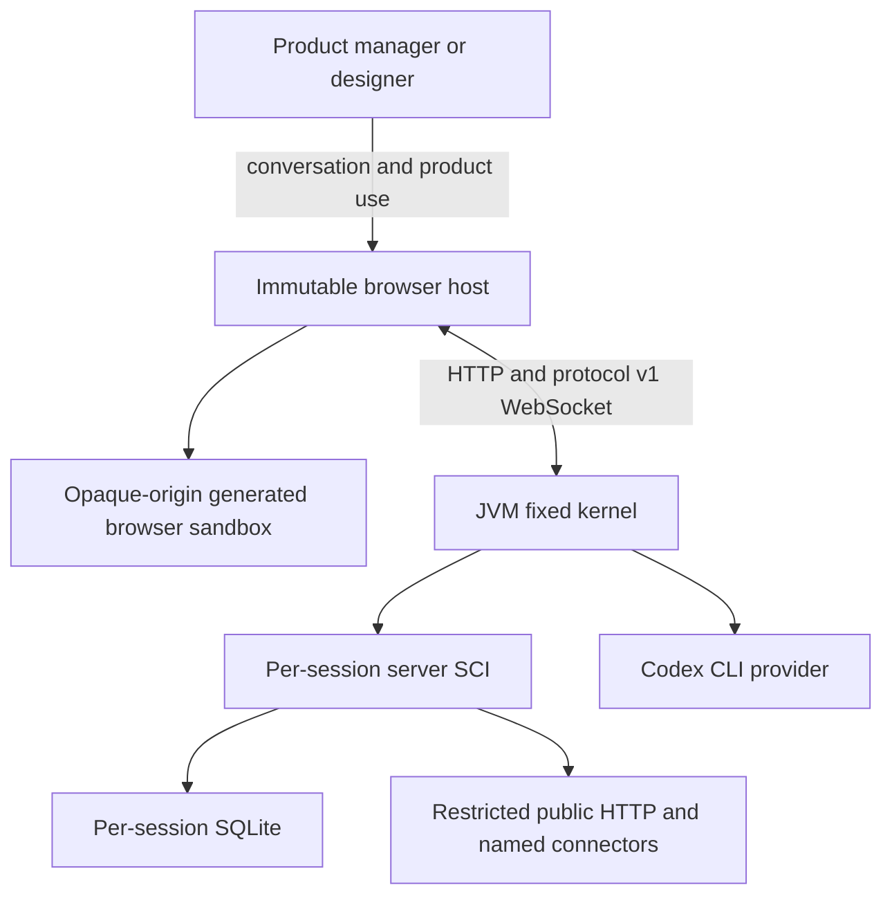

# Implementation Specification

Product: Programmable Programming Page
Status: approved implementation baseline
Protocol version: 1
Session format version: 1
Capability version: 1
Last updated: 2026-07-15

## 1. Purpose

This specification turns the behavior in `docs/PRD.md` into implementation contracts. It describes the immutable host, generated runtimes, source and data formats, transport, application transaction, recovery, provider boundary, and verification seams.

Security restrictions in `docs/SECURITY.md` override convenience choices in this document. Visible behavior in `DESIGN.md` remains a public contract even when the implementation changes.

## 2. System context



There is one deployment unit and two generated code-evaluation realms:

- JVM SCI stages generated Clojure server definitions.
- Browser SCI runs inside a sandboxed frame and stages generated ClojureScript components and routes with ordinary in-frame browser interop.

Using the same language family does not make these the same runtime. The fixed kernel coordinates them through explicit versioned messages.

## 3. Technology baseline

| Concern | Choice |
|---|---|
| JVM | Java 21 |
| Server language | Clojure 1.12.x |
| Browser language | ClojureScript 1.12.x |
| HTTP and WebSocket | http-kit |
| Routing | Reitit |
| Lifecycle | Integrant |
| Generated evaluation | SCI on JVM and browser |
| UI | Reagent in an opaque-origin sandbox with serializable state handoff |
| Persistence | SQLite JDBC and next.jdbc |
| Shared validation | Malli schemas in CLJC |
| Wire format | Transit JSON for WebSocket; JSON for HTTP |
| Build | Clojure CLI, shadow-cljs, npm |
| Command entrypoint | Babashka `bb` |
| Tests | clojure.test, Kaocha, test.check, cljs.test, Playwright |

Dependency versions are pinned in `deps.edn` and `package-lock.json`. Runtime dependency installation is not a generated capability.

## 4. Repository modules

```text
src/ppp/
├── access.clj                  access cookie and CSRF
├── config.clj                  environment parsing and limits
├── coordinator.clj             turn and commit state machine
├── http.clj                    Reitit routes and handlers
├── main.clj                    process entrypoint
├── system.clj                  Integrant lifecycle
├── websocket.clj               subscriptions, stage ACK, broadcast
├── outbound/
│   ├── client.clj              pinned-address HTTPS transport
│   ├── policy.clj              URL, address, DNS, header policy
│   └── service.clj             public request and named connectors
├── client/
│   ├── api.cljs                generated client capability surface
│   ├── core.cljs               immutable host and recovery handle
│   ├── runtime.cljs            browser SCI and hidden staging
│   └── transport.cljs          HTTP, Transit, reconnect, resync
├── provider/
│   ├── core.clj                provider protocol
│   ├── codex.clj               Codex CLI implementation
│   └── fake.clj                deterministic tests and demo fixture
├── runtime/
│   ├── catalog.cljc            single capability source of truth
│   ├── policy.cljc             source and SQL validation
│   ├── server.clj              server SCI staging and actions
│   └── sqlite.clj              databases, migrations, snapshots
├── session/
│   ├── recovery.clj            journal startup recovery
│   └── store.clj               source, history, checkpoint storage
└── shared/
    └── protocol.cljc           Malli wire and provider schemas
```

Complex transition logic carries the state-machine ASCII diagram in the coordinator, browser staging, and recovery modules. Documentation alone is not sufficient for concurrency-sensitive code.

## 5. Fixed kernel and generated runtime

### 5.1 Immutable kernel

The AI cannot modify or replace:

- access-code exchange, cookie signing, and CSRF;
- session lifecycle and path resolution;
- Codex process execution and queueing;
- provider schema validation;
- capability catalog and SCI construction;
- source, SQL, URL, connector, and quota policy;
- history, checkpoints, commit journal, and recovery;
- WebSocket version checks and stage acknowledgements;
- immutable handle, Safe Mode, and last-success sidebar;
- logs, readiness, and health endpoints.

### 5.2 Generated runtime

The AI may replace complete files that define:

- client routes and Reagent components;
- canvas and sidebar presentation;
- runtime-scoped CSS;
- server action handlers and business rules;
- shared pure domain functions;
- host-assigned SQLite migrations;
- domain and property tests;
- calls through restricted public HTTP and named connector capabilities.

## 6. Session layout

Canonical path:

```text
data/workspaces/local/sessions/<uuid>/
├── session.edn
├── current/
│   ├── manifest.edn
│   ├── source/
│   │   ├── src/server/runtime/server.clj
│   │   ├── src/client/runtime/client.cljs
│   │   ├── src/client/runtime/sidebar.cljs
│   │   ├── src/shared/runtime/domain.cljc
│   │   ├── styles/*.css
│   │   └── test/runtime/*_test.clj[s]
│   ├── migrations/
│   │   └── 000001-<host-sanitized-name>.sql
│   └── app.sqlite
├── history/
│   └── 000001-<event>/
│       ├── event.edn
│       ├── prompt.md
│       ├── assistant.md
│       ├── changes.edn
│       ├── before/<changed-files>
│       ├── after/<changed-files>
│       └── validation.edn
├── checkpoints/
│   └── <runtime-version>/
│       ├── checkpoint.edn
│       ├── manifest.edn
│       ├── source/...
│       └── app.sqlite.gz
├── journal/
│   └── <transaction-id>.edn
└── .staging/
    └── <transaction-id>/...
```

All identifiers pass through UUID parsing before path resolution. Paths are normalized and verified to remain beneath the session root.

### 6.1 `session.edn`

```clojure
{:id #uuid "..."
 :workspace-id "local"
 :title "Untitled product"
 :format-version 1
 :current-version 3
 :codex-thread-id "019f..."
 :transcript-summary "..."
 :created-at #inst "..."
 :updated-at #inst "..."}
```

The Codex thread improves conversational continuity but is not canonical. Losing it must not lose product state.

### 6.2 `manifest.edn`

```clojure
{:format-version 1
 :capability-version 1
 :runtime-version 3
 :files
 {"src/server/runtime/server.clj" "sha256..."
  "src/client/runtime/client.cljs" "sha256..."}
 :migrations ["000001-create-gallery.sql"]
 :created-at #inst "..."
 :updated-at #inst "..."}
```

`current` is a materialized view of the last successful version. Session load evaluates the manifest state directly and does not replay the entire history.

### 6.3 Generated source policy

- Complete-file writes only. Textual line offsets are unsupported.
- At most 32 generated files after a turn.
- At most 256 KiB of generated source after a turn.
- Allowed roots: `src/server`, `src/client`, `src/shared`, `styles`, `test`.
- Fixed entrypoint namespaces:
  - `runtime.server`
  - `runtime.client`
  - `runtime.sidebar`
  - `runtime.domain`
- Deleting a fixed entrypoint is rejected.
- Symlinks are never followed or created.
- Committed migration files are immutable.

## 7. Capability catalog

One CLJC value is canonical for:

1. symbols copied into JVM SCI;
2. symbols copied into browser SCI;
3. provider prompt documentation;
4. the fixed pre-release manifest contract stamp;
5. generated security documentation and test fixtures.

Before the first public release, `capability-version` remains `1` and has no compatibility branches. A breaking runtime-contract change runs `bb reset-dev-sessions` and restarts the development JVM so filesystem sessions and the in-memory runtime registry are both empty. Kernel and OAuth state remain intact. Session migration and multi-version compatibility begin only after a released session format must be preserved.

Conceptual catalog:

```clojure
{:version 1
 :server
 {'runtime.api
  {'register-action! bounded-fn
   'query! bounded-fn
   'execute! bounded-fn
   'public-http! bounded-fn
   'connector-http! bounded-fn}}
 :client
 {'runtime.api
  {'register-page! bounded-fn
   'register-sidebar! bounded-fn
   'navigate! bounded-fn
   'action! bounded-fn
   'ensure-action! bounded-fn
   'page-state stable-reagent-atom
   'event-value bounded-fn
   'prevent-default! bounded-fn}}}
```

Server SCI receives no general Java classes, shell, filesystem, process, dynamic loader, or dependency resolver. Browser SCI runs only in an iframe whose sandbox omits `allow-same-origin`; it may use that frame's ordinary DOM and browser globals. It receives no authenticated parent object. Server actions and conversation controls cross a versioned message bridge.

## 8. Codex provider

### 8.1 Interface

```clojure
(defprotocol Provider
  (ready? [provider])
  (generate! [provider request]))
```

Input:

```clojure
{:session-id uuid
 :runtime-version 3
 :prompt "..."
 :source {path complete-content}
 :transcript-summary "..."
 :thread-id "optional-codex-thread-id"}
```

Output:

```clojure
{:result
 {:kind :reply | :clarify | :change | :restore
  :assistant-message string
  :clarification-question string?
  :restore-version nat-int?
  :change
  {:title string
   :writes [{:path string :content string}]
   :deletes [string]
   :migrations [{:name string :sql string}]}}
 :thread-id string?}
```

### 8.2 Process policy

Initial turns use `codex exec`; later turns use `codex exec resume <thread-id>`. The exact argument vector is constructed with `ProcessBuilder`, never a shell string.

Required controls:

```text
--json
--output-schema <static-schema>
--output-last-message <job-temp-file>
--model gpt-5.6-terra
--sandbox read-only
--ignore-user-config
--ignore-rules
--skip-git-repo-check
--strict-config
--disable shell_tool
--disable multi_agent
--disable hooks
--disable apps
--disable browser_use
--disable computer_use
--disable image_generation
--disable memories
--disable remote_plugin
-c model_reasoning_effort="medium"
-c web_search="disabled"
-c shell_environment_policy.inherit="none"
-C <kernel-owned-workdir-with-bundled-provider-skill>
-
```

- Source and catalog context enter through stdin only.
- The work directory is unrelated to the repository and session directory. It contains only the fixed, packaged `ppp-validate-and-apply` provider Skill plus bounded result files.
- The provider explicitly invokes that Skill on every change and repair attempt. The Skill has no tools or execution authority; it documents the syntax and compatibility checklist used before host validation.
- The process environment is cleared, then receives only the minimum `CODEX_HOME`, `HOME`, and locale values.
- At kernel startup, npm-style `#!/usr/bin/env node` launchers are resolved to absolute
  Node and Codex paths. The child therefore works without inheriting `PATH`.
- Stdout JSONL is bounded and parsed for `thread.started`.
- The final message file is bounded to 512 KiB and parsed as JSON.
- Static JSON Schema validation occurs in Codex, then Malli validates again in the host.
- Default timeout is 120 seconds.
- Global concurrency is one, per-session concurrency is one, FIFO capacity is eight.
- Restore clears the stored thread ID so future context cannot assume the abandoned future state.
- A repairable source, SQL, server SCI, or browser staging rejection is returned to the same Codex thread as structured feedback. The initial proposal plus at most two corrected attempts are allowed. Only the final successful proposal enters history as a change; exhausted attempts create one rejected event. Successful history records include the host-observed attempt count and affected runtime surfaces; the provider never declares its own trusted impact flag.

### 8.3 Fake provider

The fake provider is deterministic and has no network dependency. It supports all demo turns plus explicit invalid, timeout, and refusal fixtures. CI, property tests, browser tests, and packaged smoke use it. Live OAuth evaluation runs only through explicit `bb eval-live` or `bb eval-evolution` commands.

## 9. HTTP API

All JSON responses use UTF-8 and a stable error envelope:

```json
{
  "error": {
    "code": "runtime/server-stage-failed",
    "message": "The new version could not be applied. Your current product is unchanged.",
    "requestId": "..."
  }
}
```

Internal exception text and generated source are not returned.

| Method | Path | Auth | Contract |
|---|---|---|---|
| `POST` | `/api/access` | access code | Exchange code; set signed cookie; return no secret. |
| `GET` | `/api/bootstrap` | cookie | Return CSRF token, protocol version, sessions, provider readiness. |
| `POST` | `/api/sessions` | cookie + CSRF | Create a blank persistent session. |
| `GET` | `/api/sessions/:id` | cookie | Return metadata and current version. |
| `POST` | `/api/sessions/:id/turns` | cookie + CSRF | Validate prompt; enqueue; return `202` and job ID. |
| `GET` | `/api/sessions/:id/runtime` | cookie | Return current client source bundle and manifest. |
| `GET` | `/api/sessions/:id/checkpoints` | cookie | Return nontechnical checkpoint metadata. |
| `POST` | `/api/sessions/:id/restores` | cookie + CSRF | Enqueue checkpoint restore. |
| `POST` | `/api/sessions/:id/actions/:action-id` | cookie + CSRF | Invoke active generated server action. |
| `GET` | `/healthz` | none | JVM liveness only. |
| `GET` | `/readyz` | none | Storage writable, recovery complete, provider preflight. |

### 9.1 Turn request

```json
{
  "prompt": "Make judge votes worth three points and show the top three.",
  "requestTabId": "...",
  "baseVersion": 2
}
```

Success:

```http
HTTP/1.1 202 Accepted
```

```json
{"jobId":"...","requestId":"..."}
```

## 10. WebSocket protocol

Transit JSON envelope:

```clojure
{:protocol-version 1
 :workspace-id "local"
 :session-id #uuid "..."
 :request-id #uuid "..."
 :runtime-version 3
 :type :runtime/stage
 :payload {...}}
```

Client to server:

| Type | Payload |
|---|---|
| `:session/subscribe` | `{:tab-id uuid :current-version int}` |
| `:runtime/staged` | `{:tab-id uuid :transaction-id uuid :base-version int :target-version int}` |
| `:runtime/rejected` | Same versions plus bounded diagnostic code. |

Server to client:

| Type | Payload |
|---|---|
| `:turn/queued` | queue position and job ID. |
| `:turn/progress` | one of `:generating`, `:validating`, `:applying`, `:applied`. |
| `:runtime/stage` | complete staged client source, CSS, transaction ID, base and target versions. |
| `:runtime/activate` | committed manifest and target version. |
| `:runtime/resync` | current complete client source and manifest. |
| `:turn/failed` | stable user-safe error code and message. |

The requesting tab's stage response alone determines commit. Other tabs never block a commit.

## 11. Change state machine

```text
queued
  |
  v
generating ------------------> reply or clarify
  |
  v
validating source, SQL, capability, quotas
  | failure
  +--------------------------> rejected, active state unchanged
  v
classify returned paths and clone current SQLite and source into staging
  |
  v
server/shared/test/migration affected?
  | no                         | yes
  | reuse validated runtime   | apply migrations and evaluate server SCI
  | at target version         | then rollback-only domain tests
  +---------------------------+
  | failure
  +--------------------------> discard staging
  v
send client source to request tab hidden sandbox frame
  | reject, stale, disconnect, timeout
  +--------------------------> discard staging
  v
receive exact base and target version ACK
  |
  v
write prepared journal and before backup
  |
  v
commit source, SQLite, manifest, and server registry
  |
  v
append history, create checkpoint, activate, broadcast
  |
  v
applied
```

### 11.1 Commit invariants

- Target version equals current version plus one.
- Base version still equals the active version immediately before commit.
- The ACK transaction ID, session ID, base version, target version, and requesting tab all match.
- The active server registry points to the same target version as the manifest and SQLite `_ppp_runtime_meta`.
- History is written only after the materialized state is durable.
- A failed append after materialization remains recoverable through the prepared journal.
- Reply and clarify never enter the commit path.

### 11.2 App actions during generation

Generated actions remain available while Codex generates and stages a future version. Normal action writes use SQLite transactions. Only the short final commit interval takes the per-session commit lock. The stage copy is based on a consistent SQLite snapshot.

### 11.3 Runtime-surface selection

The kernel derives impact from normalized writes, deletes, and migrations after
source-policy validation:

- `src/client/**` and `styles/**` only is `:client-only`;
- any `src/server/**`, `src/shared/**`, `test/**`, or migration is
  `:server-data`.

Client-only work still passes hidden browser staging and participates in the
same source/SQLite/checkpoint journal so one version remains reproducible. It
does not evaluate generated server source or domain tests again. Instead the
already validated server action registry is rebound to the staged SQLite
snapshot and target version, then rebound to the committed database path after
materialization. A missing active runtime fails closed. `:server-data` work
always creates a fresh SCI context, applies migrations to the staged database,
and runs generated domain tests before browser staging. History records the
host-derived impact and uses `:not-applicable` for stages that intentionally did
not run.

## 12. Browser staging

The immutable parent owns:

- access and bootstrap state;
- session selection;
- WebSocket lifecycle and reconnect;
- the bounded state handoff cache;
- authenticated action transport;
- the active and hidden sandbox-frame lifecycle;
- handle, Safe Mode, and last-success sidebar.

Stage algorithm:

1. Verify message protocol, session, requesting tab, and base version.
2. Register the pending stage before attaching a fresh opaque-origin sandbox frame, preventing a cached-frame ready race.
3. Allow up to 30 seconds for the frame bundle to load and signal readiness.
4. Start a separate 10-second render deadline only after readiness, then create a fresh SCI context.
5. Evaluate shared and client sources in deterministic order with `js` bound to the frame's `globalThis` and normal in-frame browser interop.
6. Require exactly one registered page entrypoint and one sidebar entrypoint.
7. Attach staged CSS inside the hidden frame document.
8. Render page and sidebar with representative host context.
9. Require an immutable shell sentinel to report the React DOM commit that
   contains both generated surfaces, then allow queued React error callbacks to
   settle before success. Hidden or background-frame `requestAnimationFrame`
   scheduling is never a staging-completion dependency.
10. Send `runtime/staged` or `runtime/rejected` with a bounded failure chain.
11. Keep the active frame untouched until `runtime/activate` arrives.
12. On activation, reveal the exact staged frame, remount generated children in the active phase, hand off serializable state, and destroy the previous frame.

The host may retain structured-clone-safe page state when keys remain compatible. Generated code may keep arbitrary frame-local objects, but those objects are intentionally discarded with the frame.

The server's request-tab ACK timeout is 45 seconds so it exceeds the 30-second frame-load plus 10-second render deadlines. A load timeout and a render timeout use different stable codes and different user messages.

The commit sentinel belongs to the fixed frame shell, not generated source. It
may signal only while the exact staged version is unsettled. Source evaluation,
registration, or attachment of the iframe alone is insufficient evidence of a
successful render. A generated render or ref failure wins over a queued success
signal and rejects the stage.

The fixed frame also schedules one coalesced microtask flush when approved page
state or a host-bridge sidebar/state message changes. Reagent may still use
animation scheduling as an optimization, but correctness of generated state,
handle-driven sidebar changes, and initial staging must not depend on an
animation callback running in the opaque frame.

## 13. Server staging and actions

Each staged server runtime receives a fresh SCI context and an action registry atom. Shared CLJC evaluates before server CLJ. Evaluation has a deadline and no Java class map.

`test/runtime/domain_test.cljc` is a required pre-release entrypoint. When a
change writes server/shared/test source or adds a migration, the host evaluates
generated CLJ/CLJC tests after server actions register and runs their
`clojure.test` vars inside a rollback-only transaction on the staged database.
Pure client/CSS changes do not reevaluate server SCI or rerun unrelated domain tests. Startup loads an
already validated committed manifest without replaying tests against mutable
live user data; checkpoint restore tests the checkpoint's source and database
snapshot again before activation. Tests call registered actions through
`runtime.test/invoke!`; query
and mutation capabilities work against the transaction, while public HTTP and
named connectors remain unavailable in test phase. A missing test, zero
assertions, an error, or a failed assertion rejects the stage and sends bounded
test names/counts to the provider repair loop. Assertion source, values, user
data, and test output are not copied into logs or browser messages.

Generated tests target observable domain and business invariants. For persisted
mutations they cover the read model before the change, the mutation delta, and
the read model reconstructed from SQLite. They do not lock copy, CSS classes,
DOM nesting, private function order, or layout details. Tests must stay valid
after legitimate user data changes: they create rollback-only fixture rows or
compare against a captured baseline instead of assuming seed counts, empty
tables, or existing entity scores remain unchanged.

Actions register by keyword:

```clojure
(runtime.api/register-action! :votes/create create-vote)
```

Invocation:

```clojure
{:session-id uuid
 :runtime-version 3
 :action-id :votes/create
 :input {:project-id 1 :voter-type "judge"}}
```

Action SQL allows one parameterized statement:

- read: `SELECT` only;
- write: `INSERT`, `UPDATE`, or `DELETE` only;
- no schema changes, PRAGMA, attached databases, reserved tables, or multiple statements.

Action output must be Transit/JSON representable and remain below the response limit.

## 14. SQLite migrations and snapshots

- One database per session.
- Foreign keys are enabled.
- Busy timeout is 5 seconds.
- `_ppp_runtime_meta` and `_ppp_migrations` are kernel-owned.
- Generated SQL cannot mention `_ppp_` identifiers.
- Allowed migration statement families:
  - `CREATE TABLE`
  - `CREATE INDEX`
  - `ALTER TABLE ... ADD COLUMN`
  - `INSERT`
  - `UPDATE`
  - `DELETE`
- Forbidden: `ATTACH`, `DETACH`, extensions, file functions, path PRAGMAs, `VACUUM`, temporary schema, and committed migration edits.

The kernel assigns `000001-<name>.sql` after sanitizing the descriptive name. The SQL hash is stored in `_ppp_migrations`.

Checkpoint databases are created from a live connection through SQLite's consistent backup facility, then gzip-compressed. Raw copying of a potentially active WAL database is not accepted as checkpoint evidence.

Logical content hashes exclude `_ppp_` metadata so restore properties compare user data independently of the new restore event version.

## 15. History and checkpoint semantics

History is append-only canonical evidence. It records rejected changes as events when useful, but a rejection does not receive a runtime version.

A successful change event contains:

```clojure
{:event-sequence 12
 :event-id #uuid "..."
 :kind :change
 :base-version 2
 :runtime-version 3
 :title "Weight judge votes and show the top three"
 :request-id #uuid "..."
 :created-at #inst "..."
 :validation-summary {:source :passed :server :passed :client :passed :sql :passed}}
```

Checkpoint title is an outcome, not a technical identifier. Checkpoint version zero is the initial blank canvas.

Restore semantics:

1. Validate checkpoint manifest, source hashes, gzip stream, and logical database hash.
2. Stage checkpoint source and database like a normal change.
3. Require request-tab browser staging ACK.
4. Commit as a new monotonically increasing runtime version.
5. Append a restore event referencing the source checkpoint.
6. Preserve all checkpoints.
7. Clear Codex thread ID.

## 16. Crash journal

Prepared journal:

```clojure
{:transaction-id #uuid "..."
 :session-id #uuid "..."
 :state :prepared
 :base-version 2
 :target-version 3
 :before {:manifest-hash "..." :database-hash "..." :backup-path "..."}
 :after {:manifest-hash "..." :database-hash "..." :stage-path "..."}
 :created-at #inst "..."}
```

Startup recovery is idempotent:

| Current manifest | SQLite metadata | Journal action |
|---|---|---|
| target | target | finalize history/checkpoint/registry if missing, then clear journal |
| base | base | remove abandoned staging and clear journal |
| mixed or invalid | any | restore before backup, verify base hashes, then clear journal |

Recovery runs before readiness becomes true or any session accepts actions.

## 17. Quotas

| Resource | Limit |
|---|---:|
| Prompt | 4,000 UTF-8 characters |
| Provider output | 512 KiB |
| Generated files | 32 |
| Generated source | 256 KiB |
| SQLite per session | 25 MiB |
| Checkpoints per session | 256 MiB |
| Instance data | 2 GiB |
| Codex queue | 8 jobs |

Quota exhaustion never deletes history automatically. It rejects new AI changes while leaving product use, history reading, and restore available.

## 18. Configuration

Required outside development:

```text
PPP_ENV=production
PPP_PORT=8787
PPP_DATA_DIR=/var/lib/ppp
PPP_ACCESS_CODE=<secret>
PPP_COOKIE_SECRET=<32+ random characters>
PPP_AI_PROVIDER=codex
PPP_CODEX_MODEL=gpt-5.6-terra
PPP_CODEX_REASONING=medium
PPP_REQUIRE_CLIENT_ACK=true
CODEX_HOME=/var/lib/codex
```

Tests override provider to `fake`, use a temporary data root, and may disable client ACK only in tests that do not claim coordinator integration coverage.

## 19. Observability

Structured log fields:

```text
timestamp level event request-id job-id session-id runtime-version duration-ms error-code
```

Never log:

- access code or cookie value;
- prompt or transcript;
- generated source or SQL;
- connector headers or environment names;
- Codex stdout reasoning or `auth.json` content.

`/healthz` proves process liveness. `/readyz` proves storage, recovery, and selected provider preflight. Provider model execution is not performed on every readiness check.

## 20. Verification seams

Unit and property tests call policy, store, database, runtime, and recovery modules directly. Fake-provider integration drives the same coordinator used by HTTP. Browser tests run the compiled host against a real JVM server and SQLite database. Docker smoke runs the packaged artifact, not the development classpath.

The authoritative release command is:

```bash
bb verify
```

Live OAuth evaluation is intentionally separate:

```bash
bb eval-live
bb eval-evolution
```

## 21. Requirement mapping

| PRD range | Primary specification sections |
|---|---|
| PRD-F01-F05 | 5, 9, 12 and `DESIGN.md` |
| PRD-F06-F10 | 6, 8, 9, 10 |
| PRD-F11-F15 | 5, 7, 12, 13 |
| PRD-F16-F21 | 11, 12, 13, 14 |
| PRD-F22-F26 | 6, 15, 16 |
| PRD-F27-F30 | 8 and `docs/SECURITY.md` |

## 22. Resolved decisions

- JVM Clojure server plus ClojureScript browser, one deployment unit.
- SQLite per session for the MVP.
- Actual source files, not a capability DSL or definition registry.
- Requesting tab ACK controls commit.
- Filesystem history is canonical.
- OAuth Codex provider is a gated hackathon/self-host exception.
- Fake provider is mandatory for deterministic CI and demo rehearsal.
- No source promotion during the hackathon.

Unresolved implementation decisions: none.
